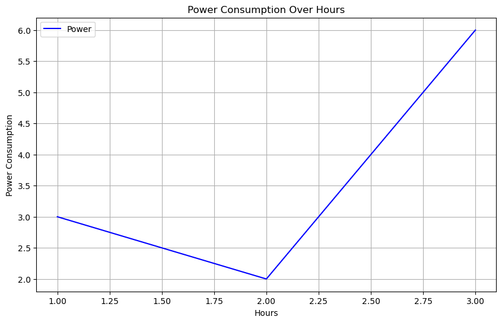
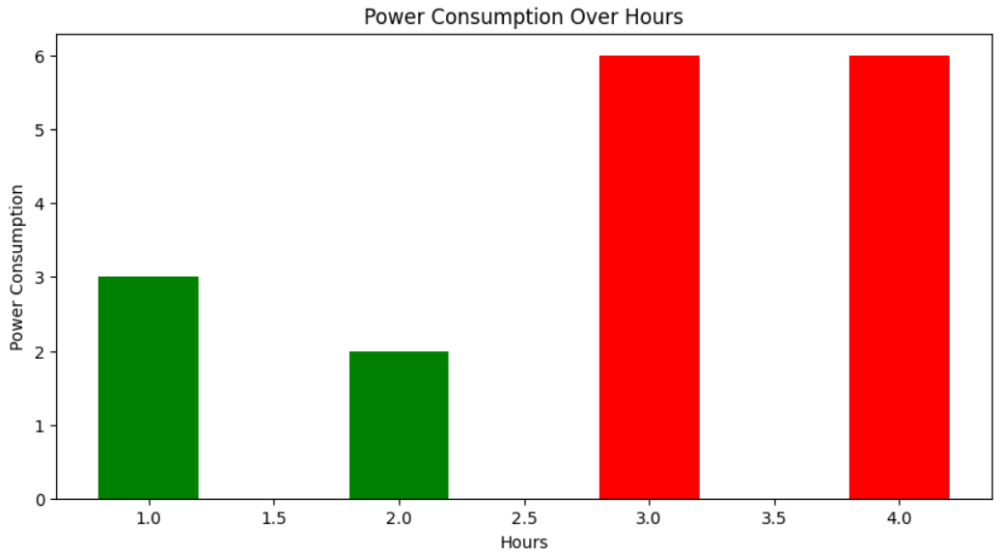
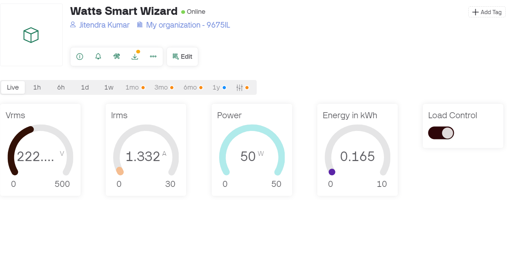
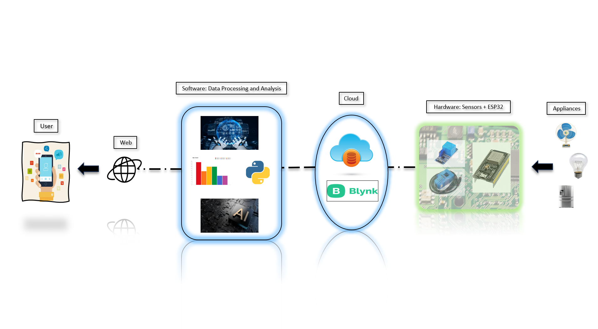
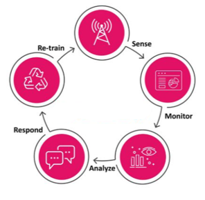

## WattSmart Wizard:

WattSmart Wizard addresses the critical global issue of resource wastage and inefficiency in energy and water management. Through a combination of IoT sensors, real-time data processing via cloud computing, and AI-powered analytics, the system monitors energy consumption and automates resource optimization. It offers personalized recommendations, alerts, and insights, allowing users to minimize waste and lower costs. The seamless integration of hardware and software makes the solution scalable, impacting both household and industrial sectors. Its focus on sustainability promotes environmental conservation while providing significant economic and social benefits.

--------------------------------------------

### Prototype

--------------------------------------------

### Consumption Trends

--------------------------------------------

### System Architecture

--------------------------------------------

### Process Flow

--------------------------------------------

### Use Case Diagram

